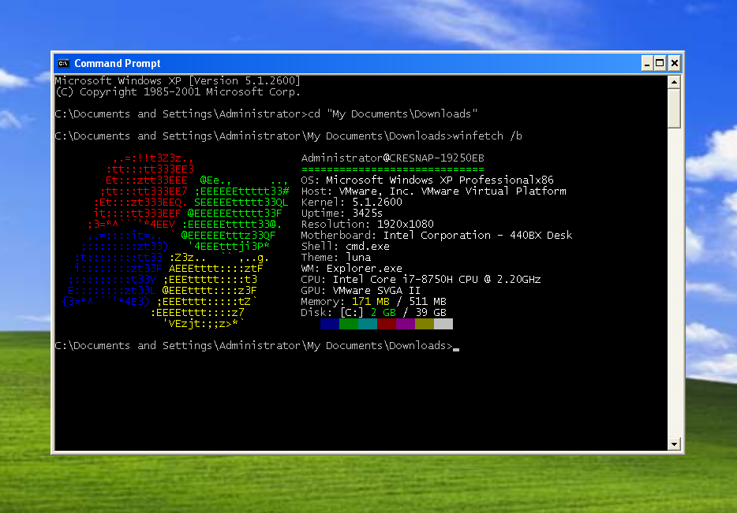

## winfetch

System information tool written in Batch.



```
Usage: winfetch [/n] [/b] [/?]

Options:
    /n             Use colors. Requires colous.
    /b             Use (brighter) colors. Requires colous.
    /?             Display this text.
Note: Output redirection does not work with colous.

Thanks to:
    anonymous
    Arashi !1IXzW.VjDs (Zanthas)
    SaladFingers !SpOONsgtAo
    Jz9 !//QwUWqnYY
    Sk8rjwd
    rashil2000
```

---
[Colous](https://diamam.blogspot.com/) is a console I/O server written for Command Prompt. The binary's VirusTotal listing can be seen [here](https://www.virustotal.com/gui/file/8dd1f2fe85aa9c47a19edd546276dd0a4cd840519cc9b944ad21633df213b99a/detection).
